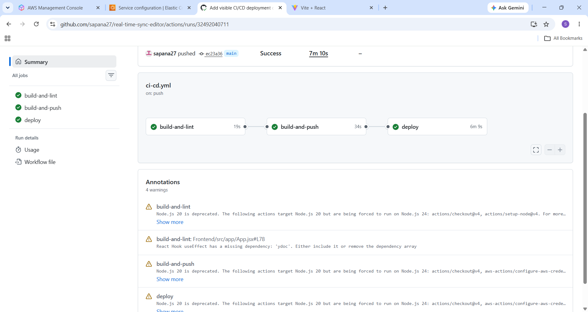
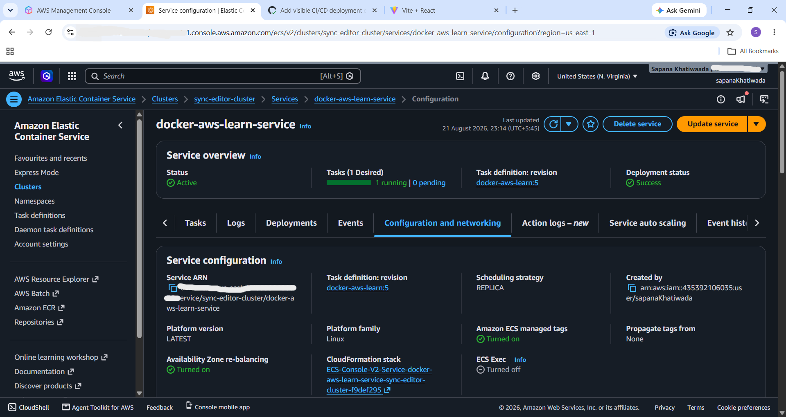
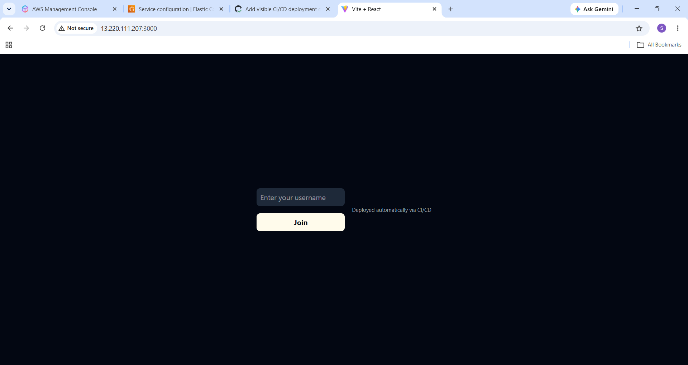

# Real-Time Sync Editor

A collaborative, real-time code editor where multiple users can join the same session and edit code together live — changes merge instantly across every browser, with a live list of who's online.

Real-time sync isn't trivial: this project solves conflict-free merging with Yjs CRDTs, and pairs it with a fully automated CI/CD pipeline (GitHub Actions → Docker → ECR → ECS Fargate) so every push to `main` builds, tests, and redeploys the app on its own.

## Demo


## Features

- Real-time collaborative code editing powered by [Yjs](https://yjs.dev) CRDTs
- Monaco Editor (the same editor that powers VS Code) with full syntax highlighting
- Live presence — see who else is currently in the session
- Username-based session joining via URL query params
- Containerized backend, deployed to AWS ECS (Fargate)

## Architecture


Two (or more) browser clients connect to a shared Express backend over WebSocket (Socket.io). Each client holds a local Yjs document; edits are merged conflict-free and broadcast to every connected client in real time via `y-socket.io`.

## Tech Stack

**Frontend**
- React + Vite
- Tailwind CSS
- `@monaco-editor/react` — code editor
- `yjs` — CRDT-based real-time sync engine
- `y-monaco` — binds Yjs to the Monaco editor
- `y-socket.io` — connects Yjs to Socket.io for network transport

**Backend**
- Node.js + Express
- Socket.io — real-time transport
- `y-socket.io` — server-side Yjs/Socket.io integration

**Deployment**
- Docker
- Amazon ECR (image registry)
- Amazon ECS on AWS Fargate (container hosting)
- GitHub Actions (CI/CD)

## Deployment

The backend is containerized with Docker, pushed to Amazon ECR, and deployed as an ECS service running on Fargate.


**ECR — image pushed and stored:**


**ECS — service running live:**


## CI/CD Pipeline

Every push to `main` triggers a fully automated pipeline via GitHub Actions — no manual build, push, or deploy steps required.

**Pipeline stages:**
1. **build-and-lint** — installs frontend and backend dependencies, runs ESLint against the frontend
2. **build-and-push** — builds the Docker image, tags it with the commit SHA and `latest`, pushes both to Amazon ECR
3. **deploy** — fetches the current ECS task definition, renders it with the new image, and deploys it to the ECS Fargate service, waiting until the new task is stable

AWS authentication uses GitHub's OIDC provider, so no long-lived AWS access keys are stored as GitHub secrets.



**ECS automatically redeploying the new task after a push:**



**Live app reflecting the change right after deploy:**



Workflow file: [`.github/workflows/ci-cd.yml`](./.github/workflows/ci-cd.yml)

> Note: the AWS deployment shown above was spun up to demonstrate this pipeline working end-to-end, then torn down afterward to avoid ongoing infrastructure costs. The Docker image remains available in ECR, and the pipeline fully reproduces the deployment automatically on the next push to `main`.

## Local Setup

```bash
# Clone the repo
git clone <your-repo-url>
cd real-time_sync_editor

# Backend
cd Backend
npm install
npm run dev

# Frontend (in a separate terminal)
cd Frontend
npm install
npm run dev
```

The frontend runs on `http://localhost:5173`, the backend on `http://localhost:3000`.

## License

MIT
