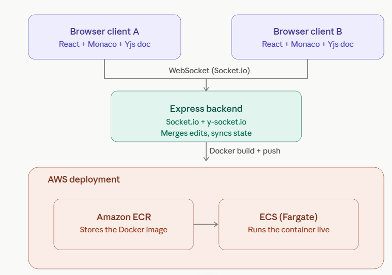
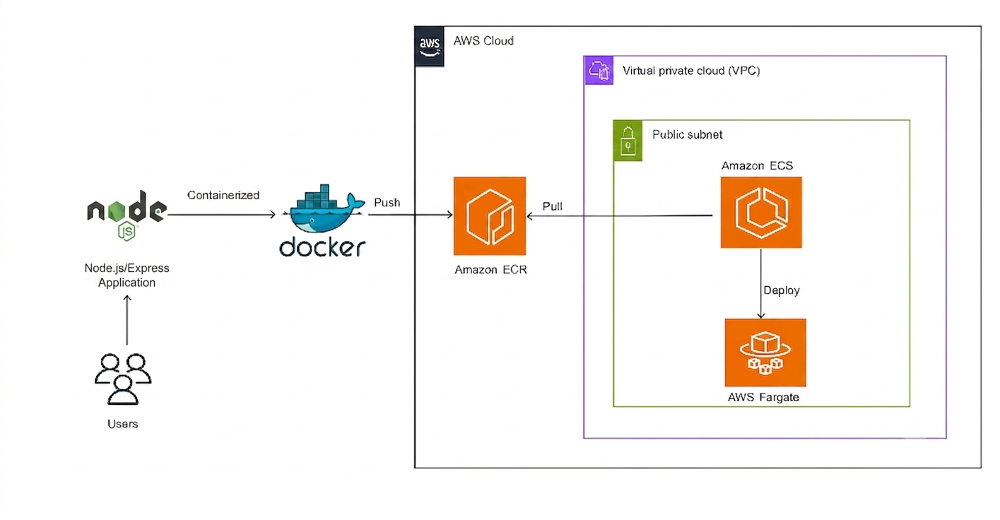
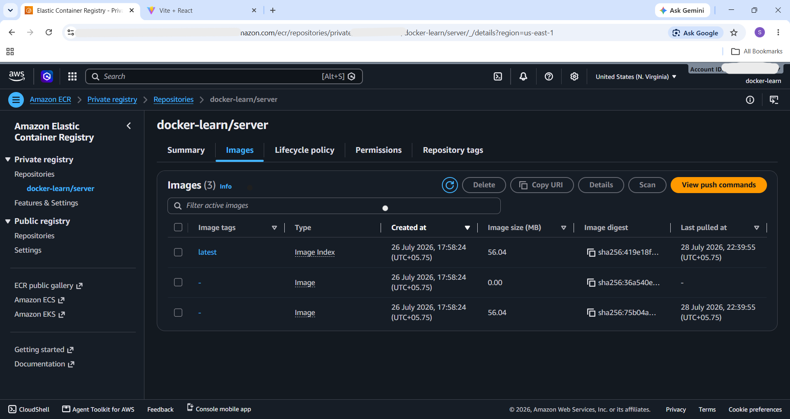
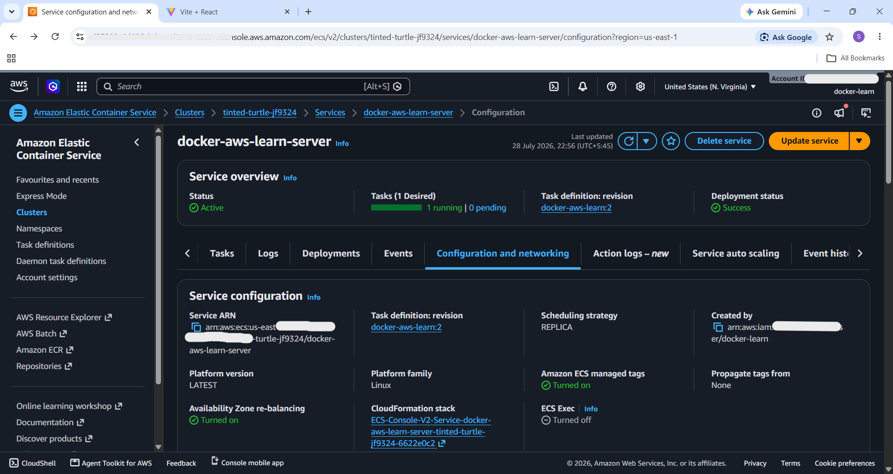

# Real-Time Sync Editor

A collaborative, real-time code editor built with React and Monaco, powered by Yjs for conflict-free syncing and deployed on AWS via Docker, ECR, and ECS Fargate.

Multiple users can join the same session and edit code together live — changes merge instantly across every connected browser, with a live list of who's currently online.

## Demo


## Features

- Real-time collaborative code editing powered by [Yjs](https://yjs.dev) CRDTs
- Monaco Editor (the same editor that powers VS Code) with full syntax highlighting
- Live presence — see who else is currently in the session
- Username-based session joining via URL query params
- Containerized backend, deployed to AWS ECS (Fargate)

## Architecture



Two (or more) browser clients connect to a shared Express backend over WebSocket (Socket.io). Each client holds a local Yjs document; edits are merged conflict-free and broadcast to every connected client in real time via `y-socket.io`.

## Tech Stack

**Frontend**
- React + Vite
- Tailwind CSS
- `@monaco-editor/react` — code editor
- `yjs` — CRDT-based real-time sync engine
- `y-monaco` — binds Yjs to the Monaco editor
- `y-socket.io` — connects Yjs to Socket.io for network transport

**Backend**
- Node.js + Express
- Socket.io — real-time transport
- `y-socket.io` — server-side Yjs/Socket.io integration

**Deployment**
- Docker
- Amazon ECR (image registry)
- Amazon ECS on AWS Fargate (container hosting)

## Deployment

The backend is containerized with Docker, pushed to Amazon ECR, and deployed as an ECS service running on Fargate.



**ECR — image pushed and stored:**



**ECS — service running live:**



> Note: the AWS deployment shown above was spun up to validate and demo the pipeline, then torn down afterward to avoid ongoing infrastructure costs. The Docker image remains available in ECR.

## Local Setup

```bash
# Clone the repo
git clone <your-repo-url>
cd real-time_sync_editor

# Backend
cd Backend
npm install
npm run dev

# Frontend (in a separate terminal)
cd Frontend
npm install
npm run dev
```

The frontend runs on `http://localhost:5173`, the backend on `http://localhost:3000`.

## License

MIT