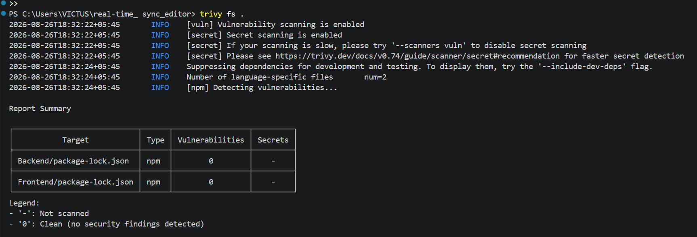

# Real-Time Sync Editor

A collaborative, real-time code editor where multiple users can join the same session and edit code together live — changes merge instantly across every browser, with a live list of who's online.

Real-time sync isn't trivial: this project solves conflict-free merging with Yjs CRDTs, and pairs it with a fully automated CI/CD pipeline (GitHub Actions → Docker → ECR → ECS Fargate) so every push to `main` builds, tests, and redeploys the app on its own.

## Demo


## Features

- Real-time collaborative code editing powered by [Yjs](https://yjs.dev) CRDTs
- Monaco Editor (the same editor that powers VS Code) with full syntax highlighting
- Live presence — see who else is currently in the session
- Username-based session joining via URL query params
- Containerized backend, deployed to AWS ECS (Fargate)

## Architecture


Two (or more) browser clients connect to a shared Express backend over WebSocket (Socket.io). Each client holds a local Yjs document; edits are merged conflict-free and broadcast to every connected client in real time via `y-socket.io`.

## Tech Stack

**Frontend**
- React + Vite
- Tailwind CSS
- `@monaco-editor/react` — code editor
- `yjs` — CRDT-based real-time sync engine
- `y-monaco` — binds Yjs to the Monaco editor
- `y-socket.io` — connects Yjs to Socket.io for network transport

**Backend**
- Node.js + Express
- Socket.io — real-time transport
- `y-socket.io` — server-side Yjs/Socket.io integration

**Deployment**
- Docker
- Terraform — Infrastructure as Code (VPC, ECS, IAM/OIDC)
- Amazon ECR (image registry)
- Amazon ECS on AWS Fargate (container hosting)
- GitHub Actions (CI/CD)

## Deployment

The backend is containerized with Docker, pushed to Amazon ECR, and deployed as an ECS service running on Fargate.


**ECR — image pushed and stored:**


**ECS — service running live:**


## Infrastructure as Code

All AWS infrastructure — VPC, subnet, security group, ECS cluster/service/task definition, and the IAM roles (including GitHub's OIDC federation) — is defined in Terraform under [`/terraform`](./terraform), rather than created by hand in the AWS console.

The reason: this project gets torn down between demos to avoid ongoing AWS costs, and rebuilt when needed. Terraform makes that reliable — `terraform apply` recreates the exact same stack every time, instead of re-clicking through console steps from memory.

| File | Provisions |
|---|---|
| `network.tf` | VPC, public subnet, internet gateway, route table, security group |
| `iam.tf` | GitHub OIDC provider, GitHub Actions IAM role (trust policy scoped to this repo), ECS task execution role |
| `ecs.tf` | ECS cluster, task definition, service (Fargate) |
| `ecr.tf` | Reads the existing ECR repository (see note below) |
| `outputs.tf` | Resource identifiers needed for the GitHub Actions secrets |

**Deliberately not managed by Terraform:** the ECR repository itself. It's read via a Terraform `data` source rather than created as a `resource`, so `terraform destroy` never deletes previously pushed images — only the compute and networking around them.

```bash
cd terraform
terraform init
terraform apply    # deploy
terraform destroy  # tear down
```

Requires an AWS CLI profile configured locally, and the variables in `variables.tf` set for your own account, region, and repo.

## CI/CD Pipeline

Every push to `main` triggers a fully automated pipeline via GitHub Actions — no manual build, push, or deploy steps required.

**Pipeline stages:**
1. **build-and-lint** — installs frontend and backend dependencies, runs ESLint against the frontend
2. **build-and-push** — builds the Docker image, tags it with the commit SHA and `latest`, pushes both to Amazon ECR
3. **deploy** — fetches the current ECS task definition, renders it with the new image, and deploys it to the ECS Fargate service, waiting until the new task is stable

AWS authentication uses GitHub's OIDC provider, so no long-lived AWS access keys are stored as GitHub secrets.


**ECS automatically redeploying the new task after a push:**


**Live app reflecting the change right after deploy:**


Workflow file: [`.github/workflows/ci-cd.yml`](./.github/workflows/ci-cd.yml)

> Note: the AWS deployment shown above is spun up on demand via Terraform (see [Infrastructure as Code](#infrastructure-as-code)) and torn down between demos to avoid ongoing costs. The Docker image stays in ECR regardless, and both the infrastructure and the running app are fully reproducible — `terraform apply` rebuilds the AWS resources, and the next push to `main` redeploys the app onto them.

## Notes & Troubleshooting

A few real issues hit while building this pipeline, and how they were diagnosed:

- **IAM trust policy vs. GitHub's OIDC token format** — the trust policy's `sub` condition used the classic `repo:OWNER/REPO:*` pattern (still the standard example in most tutorials), but GitHub's actual token for this repo used the newer [immutable subject claims](https://github.blog/changelog/2026-04-23-immutable-subject-claims-for-github-actions-oidc-tokens/) format, embedding numeric owner/repo IDs. Diagnosed via AWS CloudTrail — the denied `AssumeRoleWithWebIdentity` event showed the real `sub` claim GitHub sent — then updated `iam.tf` to match.
- **ECS task failing to start** — the execution role lacked `logs:CreateLogGroup`, needed because the task definition auto-creates its CloudWatch log group on first run (`awslogs-create-group: true`). The AWS-managed execution policy covers writing logs, not creating the log group itself.

## Security Scanning

The project is scanned locally with [Trivy](https://trivy.dev) — for known vulnerabilities in dependencies (`trivy fs`) and misconfigurations in the Dockerfile (`trivy config`).

**Dependency scan (`trivy fs .`):**

Two real vulnerabilities were found and fixed:

| Package | CVE | Severity | Issue | Fix | Commit |
|---|---|---|---|---|---|
| `nanoid` | CVE-2026-67213 | HIGH | Denial-of-service via infinite loop in `customRandom` | `3.3.16` → `3.3.18` | [`6b3506f`](https://github.com/sapana27/real-time-sync-editor/commit/6b3506f) |
| `postcss` | CVE-2026-69153 | MEDIUM | Information disclosure via crafted `sourceMappingURL` | `8.5.22` → `8.5.26` | [`f7cb305`](https://github.com/sapana27/real-time-sync-editor/commit/f7cb305) |

Both were transitive dependencies pulled in through Vite (`vite → postcss → nanoid`). A clean re-scan afterward confirms `0` vulnerabilities across both `Backend` and `Frontend`:



**Dockerfile scan (`trivy config`):**

Two informational findings were reviewed:
- **No `USER` instruction (DS-0002, HIGH)** — the container runs as root. Assessed as low risk for this specific app (no runtime file writes, no privileged ports involved), so left as a documented follow-up rather than an urgent fix.
- **No `HEALTHCHECK` instruction (DS-0026, LOW)** — noted as a possible future improvement.

## Local Setup

```bash
# Clone the repo
git clone <your-repo-url>
cd real-time_sync_editor

# Backend
cd Backend
npm install
npm run dev

# Frontend (in a separate terminal)
cd Frontend
npm install
npm run dev
```

The frontend runs on `http://localhost:5173`, the backend on `http://localhost:3000`.

## License

MIT
